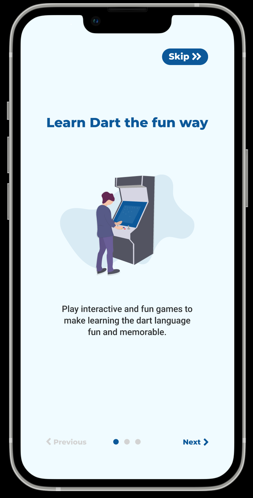
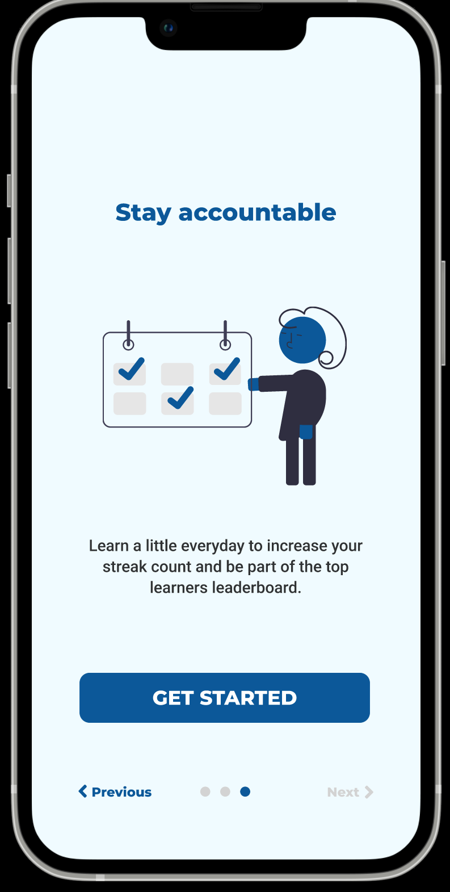
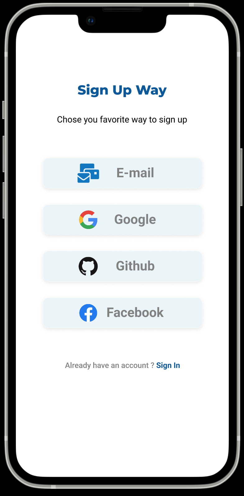
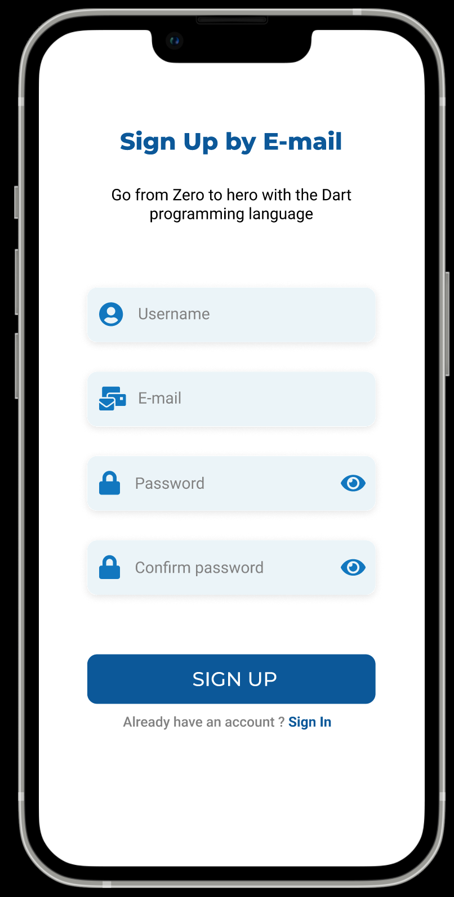
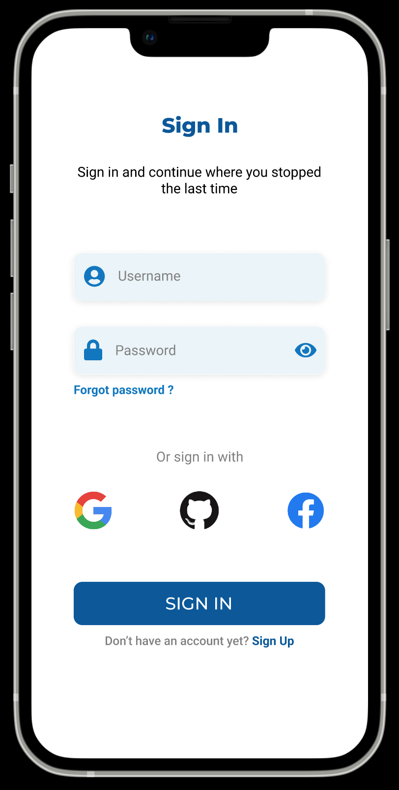

<h1>
  <p align="center" ><b>
    Hacktoberfest'2022
    <br/>
    <br/>
    Flutter Mobile Application
  </p></b>
</h1>

<h1 align=center> Tech Stack 🔥 </h1>  
  <p align="center">
    
  
  </p>


<h2>
  <p align="center" ><b>
Fellow Developers, a warm welcome to the dart side of this repository!
     </p></b>
</h2>

## What is Hacktoberfest?
Hacktoberfest is a month long celebration of open source software by DigitalOcean encouraging anyone to join the community.

### What is required in Hacktoberfest?
- Get atleast 4 PRs which are merged and NOT tagged as spam (or you will be taken out of the competition)

## Project Maintainer ⚡  :

<h2 align="center">Admin</h2>

<table align="center">
<tr>
<td align="center"><a href="https://github.com/mdnazisharman2803"></a></br> <h4  style="color:blue">Md Nazish Arman</h4><br>
</td>
</tr>
</table>

<br>


## About this repository
This repository is beginner friendly with designs that will be available for implementation when we will be creating issues - if designs are not available and required then we will create an issue for that as well. 

The goal of this project is to help anyone (of any level) contribute to an open source project during the hacktoberfest.

## App Design

This section contain the images of what the app will look like

### OnBoarding Screens

<table border="0">
<tr>
<td align="center" ><br><p><b>OnBoarding screen 1</b></p></td>
<td align="center"><br><p><b>OnBoarding screen 2</b></p></td>
<td align="center"><br><p><b>OnBoarding screen 3</b></p></td>
</tr>
</table>

### Sign Up Screens

<table border="0">
<tr>
<td align="center" ><br><p><b>Sign Up Way screen</b></p></td>
<td align="center"><br><p><b>Sign Up by E-mail</b></p></td>
</tr>
</table>

### Sign In Screen
<div><br><p><b>Sign In screen</b></p></div>

### Purpose of this project is to implement a playground for developers to practice with Dart and solve Data Structures & Algorithms.

Therefore feel free to contribute if:
1. you are a beginner, mid or senior level Flutter Developer
2. you are a designer
3. you will be documentating the code
4. you will be working on the server side

## Why contribute?
- If you find any errors or bugs then please report them by creating an issue. 
- If you can provide a more efficient solution or implementation of the algorithm then make sure to contribute. 
- If you want to implement an algorithm, data structure etc.., which is not yet there, then you can open up a PR regarding the same.
 
## Want to contribute?
- Take a look at [CONTRIBUTING.md](/CONTRIBUTING.md)


<h1 align=center> Give a Star if you like the project ⭐ </h1>

<h1 align=center>🛠️ Installation Steps</h1>


1. Open Terminal and Clone the Repo

```bash
  git clone https://github.com/username/reponame
```
 2. Cd Over 
 
```bash
   cd reponame
```
 3. Run Pub
```
   Flutter pub get
```
4. Run App 
```
  Happy Coding❤️
```

<br>

# FAQs (Frequently Asked Questions)

- Who all can contribute?
  - Anyone with a github account and who is signed up for
[hacktoberfest](https://hacktoberfest.digitalocean.com/) :)
- Are you getting paid for this?
  - Sadly no. But we think we should. This is 100% unofficial and we do it for fun, fame and glory.

- Why are you using Flutter?
- Flutter code can run on desktop, mobile, and web platforms. So, you don't need to hire developers for each platform. You need to write the code only once in Flutter and you can rest assured that the app will work across the other platforms.

- Should I come closer to the text saying 'Don't come closer' on the left side of the home tab ?
  - Nope.
- How many pull request (PR) must be made, if I want to get an awesome tshirt from Hacktoberfest 2022?
  - 4
- How do I track my progress to get an awesome shirt from Hacktoberfest 2022?
  - [go to :](https://hacktoberfest.digitalocean.com/profile/). (Check Out Your Own Stats at Right Top)
- What is the duration of Hacktoberfest 2022?
  - It is from 1st october to 31st october 2022...
- What is the event for?
  - For the open source community engagement

If you would like to make a pull request, feel free to take a look at the [CONTRIBUTING.md](/CONTRIBUTING.md)
